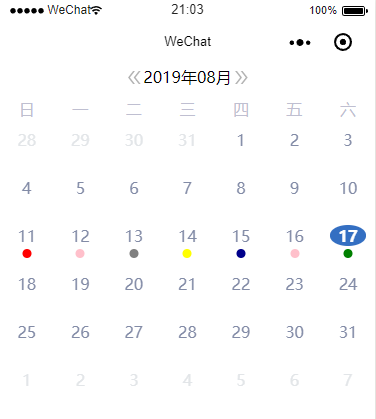
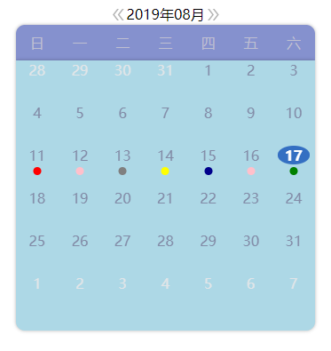
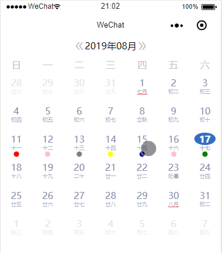
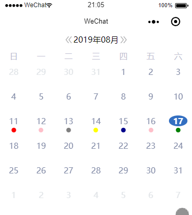
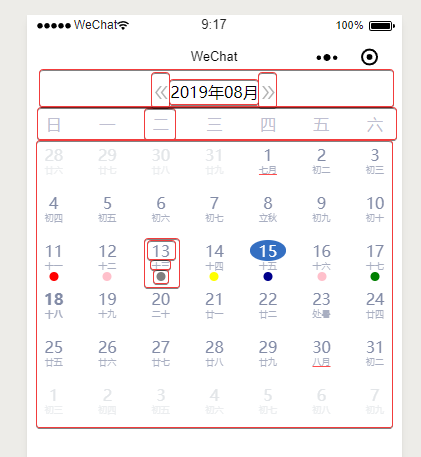

# taro-calendar-customizable
[](https://www.npmjs.com/package/taro-calendar-customizable)
[](https://david-dm.org/zkytech/taro-calendar-customizable)
[](https://opensource.org/licenses/mit-license.php)

可定制标记样式的 `taro` 日历组件。本组件的初期设计完全参考`taro-ui`中的`calendar`组件。在其之上进行了功能扩充和优化。


> ## 特性

- 可定制样式
- 支持农历显示

> ## 安装

`yarn add taro-calendar-customizable`

`npm install taro-calendar-customizable`

> ## 使用

```typescript jsx
import  Taro,{ FunctionComponent } from '@tarojs/taro';
import Calendar from './calendar/index';

const Index: FunctionComponent = () => {
  return (
    <Calendar
      marks={[

        { value: '2019-08-11', color: 'red', markSize: '9px' },
        { value: '2019-08-12', color: 'pink', markSize: '9px' },
        { value: '2019-08-13', color: 'gray', markSize: '9px' },
        { value: '2019-08-14', color: 'yellow', markSize: '9px' },
        { value: '2019-08-15', color: 'darkblue', markSize: '9px' },
        { value: '2019-08-16', color: 'pink', markSize: '9px' },
        { value: '2019-08-17', color: 'green', markSize: '9px' },
      ]}
      mode='lunar'
      selectedDateColor='#346fc2'
      onDayClick={item => console.log(item)}
      onDayLongPress={item => console.log(item)}
    />
  );
};

export default Index;

```

>### 样式定制

这里展示了最简单的样式设置方式，具体到日期单元格样式的定制可以使用[customStyleGenerator](#样式定制参数)
```typescript jsx
import  Taro,{ FunctionComponent } from '@tarojs/taro';
import Calendar from './calendar/index';

const Index: FunctionComponent = () => {
  return (
    <Calendar
      marks={[

        { value: '2019-08-11', color: 'red', markSize: '9px' },
        { value: '2019-08-12', color: 'pink', markSize: '9px' },
        { value: '2019-08-13', color: 'gray', markSize: '9px' },
        { value: '2019-08-14', color: 'yellow', markSize: '9px' },
        { value: '2019-08-15', color: 'darkblue', markSize: '9px' },
        { value: '2019-08-16', color: 'pink', markSize: '9px' },
        { value: '2019-08-17', color: 'green', markSize: '9px' },
      ]}
      mode='normal'
      isMultiSelect
      selectedDateColor='#346fc2'
      onDayClick={item => console.log(item)}
      onDayLongPress={item => console.log(item)}
      headStyle={{backgroundColor:"RGBA(12,36,157,0.5)",borderTopLeftRadius:'10px',borderTopRightRadius:'10px',boxShadow:'0 0 5px RGBA(0,0,0,0.3)',width:'90vw',marginLeft:'5vw',zIndex:2}}
      bodyStyle={{backgroundColor:"lightblue",borderBottomLeftRadius:'10px',borderBottomRightRadius:'10px',boxShadow:'0 0 5px RGBA(0,0,0,0.3)',borderTop:"none",width:'90vw',marginLeft:'5vw'}}
    />
  );
};

export default Index;
```






> ## 参数说明

| 参数          | 说明                               | 类型                                                 | 默认值       |
| ------------- | ---------------------------------- | ---------------------------------------------------- | ------------ |
| mode          | 显示模式，普通或农历               | `"normal"`&#124;`"lunar"`                            | `"normal"`   |
| currentDate   | 当前时间，格式：`YYYY-MM-DD`       | `string`                                             | `Date.now()` |
| minDate       | 最小的可选时间，格式：`YYYY-MM-DD` | `string`                                             | `1970-01-01` |
| maxDate       | 最大的可选时间，格式：`YYYY-MM-DD` | `string`                                             | `null`       |
| isSwiper      | 是否可以滑动                       | `boolean`                                            | `true`       |
| marks         | 需要标记的时间                     | `Array<{value:string,color:string,markSize:string}>` | `[]`         |
| hideArrow     | 是否隐藏箭头                       | `boolean`                                            | `false`      |
| isVertical    | 是否垂直滑动                       | `boolean`                                            | `false`      |
| isMultiSelect | 是否范围选择                       | `boolean`                                            | `false`      |
| showDivider   | 是否显示分割线                     | `boolean`                                            | `false`      |


> ## 事件说明

| 参数             | 说明                                   | 类型                           |
| ---------------- | -------------------------------------- | ------------------------------ |
| onClickPreMonth  | 点击箭头去上一个月的时候触发           | `() => any`                    |
| onClickNextMonth | 点击箭头去下一个月的时候触发           | `() => any`                    |
| onDayClick       | 点击日期时候触发                       | `(item:{value:string}) => any` |
| onDayLongPress   | 长按日期时触发(长按事件与点击事件互斥) | `(item:{value:string}) => any` |
| onMonthChange    | 月份改变时触发                         | `(value: string) => any`       |
| onSelectDate     | 选中日期时候触发                       | `(value: SelectDate) => any`   |


>## 样式定制参数

| 参数                 | 说明                             | 类型                                                                                       |
| -------------------- | -------------------------------- | ------------------------------------------------------------------------------------------ |
| customStyleGenerator | 自定义单元格样式生成器           | (dateInfo:[StyleGeneratorParams](#StyleGeneratorParams) ) => [CustomStyles](#CustomStyles) |
| headStyle            | head整体样式                     | `CSSProperties`                                                                            |
| headCellStyle        | head单元格样式                   | `CSSProperties`                                                                            |
| bodyStyle            | body整体样式                     | `CSSProperties`                                                                            |
| leftArrowStyle       | 左箭头样式                       | `CSSProperties`                                                                            |
| rightArrowStyle      | 右箭头样式                       | `CSSProperties`                                                                            |
| datePickerStyle      | 日期选择器样式                   | `CSSProperties`                                                                            |
| pickerRowStyle       | 日期选择器&左右箭头 所在容器样式 | `CSSProperties`                                                                            |
进行样式定制时可以参考组件内部结构图：



## 类型说明

> ### StyleGeneratorParams

每个单元格包含的所有信息

| 参数         | 说明                                                                    | 类型                                  |
| ------------ | ----------------------------------------------------------------------- | ------------------------------------- |
| date         | 当前月的第几天1 ~ 31                                                    | `number`                              |
| currentMonth | 是否是属于当前显示的月份（比如7月31日不属于8月，但是会显示在8月这一页） | `boolean`                             |
| fullDateStr  | 时间 YYYY-MM-DD                                                         | `string`                              |
| selected     | 是否被选中                                                              | `boolean`                             |
| marked       | 是否标记                                                                | `boolean`                             |
| multiSelect  | 多选模式参数                                                            | [MultiSelectParam](#MultiSelectParam) |
| lunar        | 农历信息（仅在农历模式下生效）                                          | [LunarInfo](#LunarInfo) 或 `null`     |

>### CustomStyles

样式生成器返回结果

| 参数           | 说明           | 类型            |
| -------------- | -------------- | --------------- |
| lunarStyle     | 农历样式       | `CSSProperties` |
| dateStyle      | 日期样式       | `CSSProperties` |
| markStyle      | 标记样式       | `CSSProperties` |
| containerStyle | 容器单元格样式 | `CSSProperties` |


>### MultiSelectParam

多选模式参数

| 参数              | 说明             | 类型      |
| ----------------- | ---------------- | --------- |
| multiSelected     | 是否在选择范围内 | `boolean` |
| multiSelectedStar | 是否是选择起点   | `boolean` |
| multiSelectedEnd  | 是否是选择终点   | `boolean` |


>### LunarInfo

农历信息

| 参数     | 说明                     | 类型             |
| -------- | ------------------------ | ---------------- |
| Animal   | 生肖                     | `string`         |
| IDayCn   | 中文 农历 日 (例:'初二') | `string`         |
| IMonthCn | 中文 农历 月 (例:'八月') | `string`         |
| Term     | 二十四节气               | `string`或`null` |
| astro    | 星座                     | `string`         |
| cDay     | 公历 日                  | `number`         |
| cMonth   | 公历 月                  | `number`         |
| cYear    | 公历 年                  | `number`         |
| gzDay    | 天干地支纪年 日          | `string`         |
| gzMonth  | 天干地支纪年 月          | `string`         |
| gzYear   | 天干地支纪年 年          | `string`         |
| isLeap   | 是否是闰月               | `boolean`        |
| isTerm   | 是否是节气               | `boolean`        |
| isToDay  | 是否是今天               | `boolean`        |
| lDay     | 农历 日                  | `number`         |
| lMonth   | 农历 月                  | `number`         |
| lYear    | 农历 年                  | `number`         |
| nWeek    | 一周的第几天 1~7         | `number`         |
| ncWeek   | 星期 (例:'星期五)        | `string`         |

> 农历信息的生成使用的是[calendar.js](https://github.com/jjonline/calendar.js)，可直接调用农历信息生成工具

农历生成工具调用

```typescript
import {CalendarTools} from 'taro-calendar-customizable';

const LunarInfo = CalendarTools.solar2lunar("2019-08-17")
```


