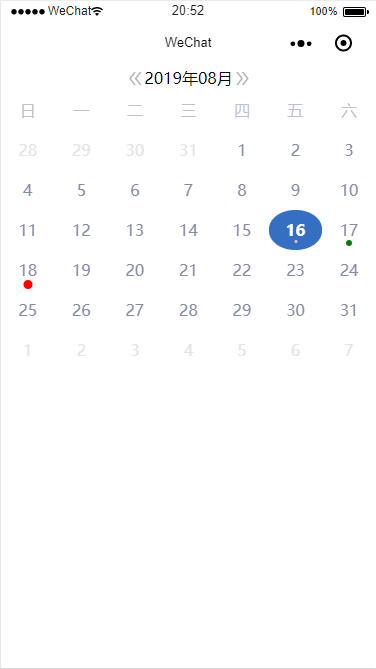
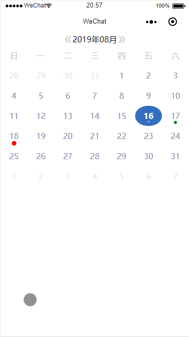

# taro-calendar-customizable

[](https://www.npmjs.com/package/taro-calendar-customizable)

可定制标记样式的 `taro` 日历组件。本组件的 UI 设计与接口设计完全参考`taro-ui`中的`calendar`组件。暂不支持`范围选择`。

既然与`taro-ui`中的日历高度一致，那为什么要使用`taro-calendar-customizable`？

1. `taro-ui`日历组件的效率很低，在我的应用中进行真机调试时，日历对点击操作的响应延迟甚至超过 1s 

2. `taro-ui`日历组件的标记样式单一，无法利用`颜色`来区分标记


> ## 特性

- 快速响应操作
- 可定制对单个日期的标记颜色
- 可定制选中日期的背景色


> ## 安装

`yarn add taro-calendar-customizable`

`npm install taro-calendar-customizable`

> ## 使用

```typescript jsx
import Taro, { FunctionComponent } from '@tarojs/taro';
import Calendar from 'taro-calendar-customizable';

const Index: FunctionComponent = () => {
  return (
    <Calendar
      marks={[
        { value: '2019-08-16', color: 'pink', markSize: '3px' },
        { value: '2019-08-17', color: 'green', markSize: '6px' },
        { value: '2019-08-18', color: 'red', markSize: '9px' }
      ]}
      selectedDateColor="#346fc2"
      onDayClick={item => console.log(item)}
      onDayLongPress={item => console.log(item)}
    />
  );
};

export default Index;
```





> ## 参数说明

| 参数        | 说明                               | 类型                                                 | 默认值       |
| ----------- | ---------------------------------- | ---------------------------------------------------- | ------------ |
| currentDate | 当前时间，格式：`YYYY-MM-DD`       | `string`                                             | `Date.now()` |
| minDate     | 最小的可选时间，格式：`YYYY-MM-DD` | `string`                                             | `1970-01-01` |
| maxDate     | 最大的可选时间，格式：`YYYY-MM-DD` | `string`                                             | `null`       |
| isSwiper    | 是否可以滑动                       | `boolean`                                            | `true`       |
| marks       | 需要标记的时间                     | `Array<{value:string,color:string,markSize:string}>` | `[]`         |
| hideArrow   | 是否隐藏箭头                       | `boolean`                                            | `false`      |
| isVertical  | 是否垂直滑动                       | `boolean`                                            | `false`      |

> ## 事件说明

| 参数             | 说明                                   | 类型                           |
| ---------------- | -------------------------------------- | ------------------------------ |
| onClickPreMonth  | 点击箭头去上一个月的时候触发           | `() => any`                    |
| onClickNextMonth | 点击箭头去下一个月的时候触发           | `() => any`                    |
| onDayClick       | 点击日期时候触发                       | `(item:{value:string}) => any` |
| onDayLongPress   | 长按日期时触发(长按事件与点击事件互斥) | `(item:{value:string}) => any` |
| onMonthChange    | 月份改变时触发                         | `(value: string) => any`       |
